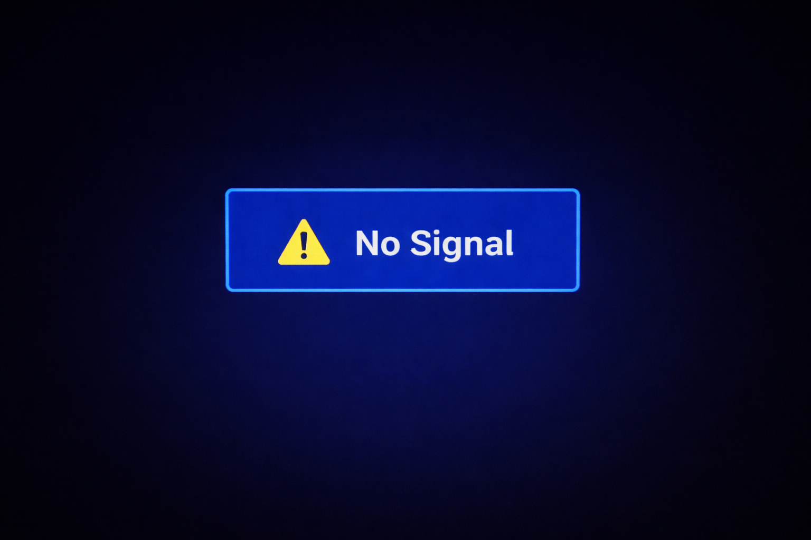
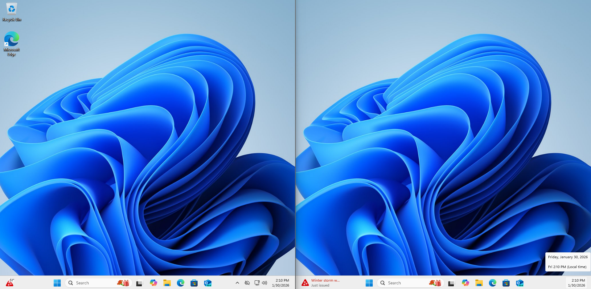

  <h1> IT Systems Support Troubleshooting Lab</h1>
  <h3>Higher Education & Clinical Classroom IT Support Simulation</h3>
  
Hands-on proof of endpoint, AV, conferencing, and network troubleshooting skills

---

##  Project Overview

This repository demonstrates **real-world IT support scenarios** aligned with a university and clinical campus environment.  

Each case simulates issues commonly faced by **faculty, staff, and classroom environments**, and includes:

 Documented troubleshooting process  
 Diagnostic command outputs  
 Root cause analysis  
 Resolution verification  
 Escalation decisions  
 Preventive recommendations  

This lab reflects the responsibilities of an **IT Systems Support Professional** supporting endpoints, AV systems, conferencing technology, and campus users.

---

##  Skills Demonstrated

| Area | Hands-On Proof Included |
|------|------------------------|
|  Windows & macOS Support | Outlook, OneDrive, device settings, user-side diagnostics |
|  Network Troubleshooting | DNS failure, IP diagnostics, connectivity testing |
|  Classroom AV Support | “No signal” display, audio routing, cable/input testing |
|  Zoom / Teams Support | Mic issues, permissions, device selection |
|  Peripheral Support | Printer spooler recovery |
|  IT Service Management | Ticket documentation, timelines, escalation logic |

---

##  Case Files (Troubleshooting Scenarios)

Each case below includes full ticket documentation and visual proof.

###  TKT-001 — Wi-Fi Connected but No Internet (DNS Failure)
**Skills:** Network diagnostics, command-line troubleshooting  
📄 [View Case File](tickets/TKT-001-wifi-dns-failure.md)

  
  

---

###  TKT-002 — OneDrive Not Syncing
**Skills:** Microsoft 365, cloud storage troubleshooting  
📄 [View Case File](tickets/TKT-002-onedrive-sync-stuck.md)

  
  

---

###  TKT-003 — Classroom Display Shows “No Signal”
**Skills:** AV troubleshooting, display configuration, cable/input isolation  
📄 [View Case File](tickets/TKT-003-display-no-signal.md)

  
  

---

###  TKT-004 — Teams Meeting Has No Microphone Audio
**Skills:** Conferencing platforms, OS permissions, audio routing  
📄 [View Case File](tickets/TKT-004-zoom-no-audio.md)

  
  

---

###  TKT-005 — Outlook Fails to Load Mail Profile
**Skills:** Office troubleshooting, credential repair, profile rebuild  
📄 [View Case File](tickets/TKT-005-outlook-profile-corruption.md)

  
  

---

###  TKT-006 — Printer Jobs Stuck in Queue
**Skills:** Windows services, spooler reset, user-side printer support  
📄 [View Case File](tickets/TKT-006-printer-spooler-stuck.md)

  
  

---

##  Rapid Response Checklists

Designed for **time-sensitive classroom and meeting support**.

| Checklist | Purpose |
|-----------|---------|
|  [Classroom AV Rapid Response](docs/checklists/classroom-av-rapid-response.md) | Fix display/audio issues in under 3 minutes |
|  [Network Triage](docs/checklists/network-triage.md) | Quickly isolate DNS vs gateway vs device issues |
|  [Zoom / Teams Triage](docs/checklists/zoom-teams-triage.md) | Fast conferencing troubleshooting |

---

##  Troubleshooting Framework

All incidents were resolved using a structured methodology:

📄 [View Troubleshooting Framework](docs/troubleshooting-framework.md)

---

##  Escalation Logic

Demonstrates understanding of **when to resolve locally vs escalate** to networking, security, or AV teams.

📄 [View Escalation Matrix](docs/escalation-matrix.md)

---

##  Lab Environment

| Component | Description |
|-----------|------------|
| Host System | Windows / macOS laptop |
| Virtualization | VirtualBox Windows VM |
| Conferencing Tools | Zoom, Microsoft Teams |
| Productivity Suite | Microsoft 365 |
| Network Testing | IP/DNS diagnostics via CLI |

📄 Full setup: [Lab Setup Documentation](docs/lab-setup.md)

---

##  Outcome

This project demonstrates the ability to:

 Troubleshoot under time pressure  
 Support classroom and meeting technology  
 Diagnose endpoint and connectivity issues  
 Communicate clearly through structured ticket documentation  
 Apply escalation judgment appropriately  

This mirrors real-world responsibilities in a **higher education and clinical IT support environment**.

---

  <b> Built as a hands-on demonstration of practical IT support readiness</b>

