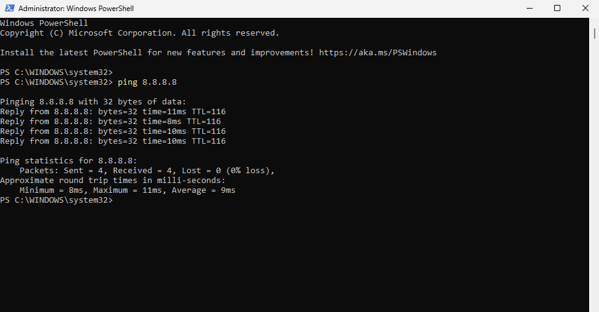

# TKT-001 – Connected to Network but No Internet (DNS Failure)

## Environment
- Device: Windows 11 Virtual Machine (VirtualBox)
- Network Mode: Bridged Adapter
- User Type: Faculty Laptop (Simulated)
- Location: Remote/Home Network
- Urgency: User unable to access websites before virtual meeting

---

## Problem Statement (User Description)
User reports they are connected to the network, but websites will not load. The system shows network connectivity, but browsers display DNS errors.

---

## Initial Assessment
- Scope: Single endpoint affected
- Network Status: Connected to LAN
- Symptom Type: Internet reachable by IP, but domain names fail
- Initial Hypothesis: DNS resolution failure

---

## Troubleshooting Timeline

### 1) Verified adapter configuration
Opened Network Connections to review adapter settings.

---

### 2) Inspected IPv4 properties
Confirmed DNS was manually configured with invalid servers.

---

### 3) Attempted web access
Browser unable to load Google; DNS error displayed.

---

### Tested basic connectivity
Result: Successful replies confirmed internet routing is functional.

---

### Tested name resolution
Result: Host not found.

---

### Confirmed DNS failure
Result: DNS request timed out.

---

### Reviewed full network configuration
Confirmed incorrect DNS servers were configured.

---

## Root Cause
The system’s IPv4 DNS servers were manually configured with invalid addresses (`1.2.3.4` and `5.6.7.8`), preventing domain name resolution. Internet routing remained functional, but DNS queries could not be resolved.

---

## Resolution Steps

1. Opened IPv4 properties for the network adapter
2. Reconfigured DNS servers to valid public resolvers:
   - 8.8.8.8 (Google DNS)
   - 1.1.1.1 (Cloudflare DNS)
3. Flushed DNS cache:

4. Renewed DHCP lease:

---

## Verification

| Test | Result |
|------|--------|
| `ping 8.8.8.8` | Successful |
| `ping google.com` | Successful |
| `nslookup google.com` | Returned valid IP |
| Browser test | Websites load normally |

---

## Prevention / Best Practice
- Avoid manually setting DNS unless required
- Always verify DNS entries when connectivity issues affect web access
- Use `ipconfig /all` to confirm active DNS servers

---

## Escalation Decision
Not escalated. Issue was isolated and resolved at endpoint level.

---

## Lessons Learned
This scenario reinforced the importance of distinguishing between:
- Network routing issues
- DNS resolution failures

It also demonstrated how a system can appear “connected” while still being unable to reach websites due to name resolution problems.

---

**Status: Resolved**

