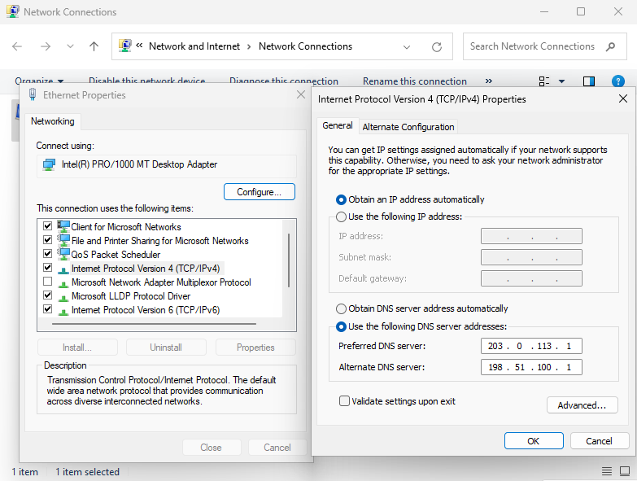
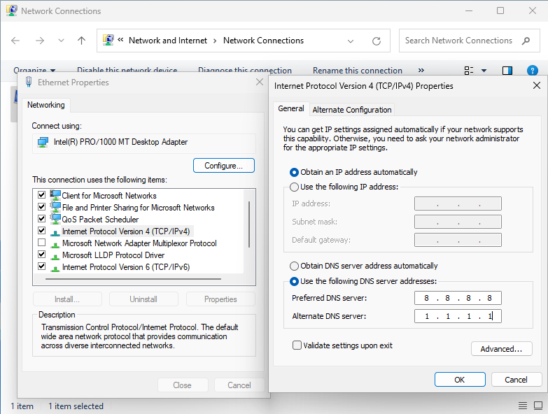
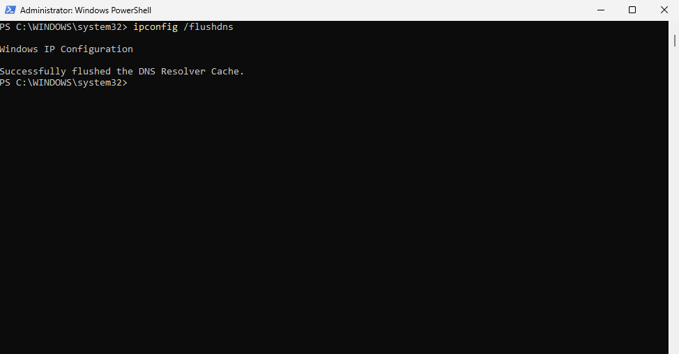
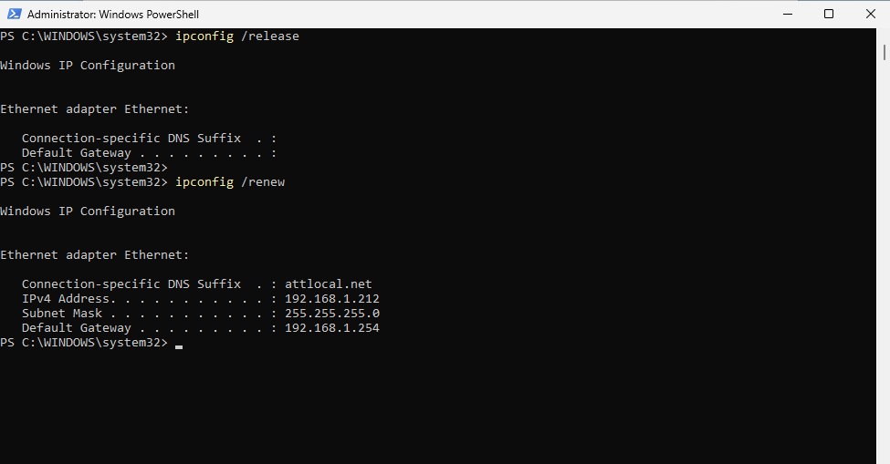

# TKT-001 – Connected to Network but No Internet (DNS Failure)

## User intake form
- Who: Dr. Sarah Mitchell / sarah.mitchell@university.edu
- What: Laptop connected to the network but unable to access websites.
- When: Issue noticed immediately before a scheduled virtual meeting (approx. 20 minutes prior to ticket submission)
- Where: Remote faculty office
- Why: Unable to access materials and web resources required for work
- How: Unknown
- Urgency: High 

---

## IT input/verification
- Who: Dr. Sarah Mitchell / sarah.mitchell@university.edu
- What: Confirmed device has valid IP address but cannot resolve domain names. Connectivity to external IPs is functional.
- When: Verified immediately after ticket intake
- Where: Remote user device
- Why: DNS resolution failure preventing web access
- How: Suspected misconfigured DNS settings
- Urgency: High

---

## Initial Assessment
- Scope: Single endpoint affected
- Recent changes: None mentioned 
- Hypothesis: DNS resolution failure / possible network configuration errors

---

## Troubleshooting Timeline

### 1) Replicated user issue
Opened the web browser to verify connectivity issues.

---

### 2) Tested basic connectivity
Result: ping 8.8.8.8 showed successful replies, confirming internet routing is functional.

---

### 3) Tested name resolution
Result: ping google.com returned a host not found error.

---

### 4) Confirmed DNS failure
Result: nslookup google.com returned a DNS request timeout.
Noticed: Invalid DNS address of 203.0.113.1

---

### 5) Reviewed full network configuration
Result: ipconfig /all showed full Windows IP and network adapter configurations.
Confirmed: Incorrect DNS servers were configured (203.0.113.1 & 198.51.100.1).

---

### 6) Inspected IPv4 properties
Result: cmd+r > ncpa.cpl > Ethernet Properties > Ipv4 Properties showed misconfigurations.
Confirmed: DNS was manually configured with invalid servers.

---

## Root Cause
The system’s IPv4 DNS servers were manually configured with invalid addresses (`203.0.113.1` and `198.51.100.1`), preventing domain name resolution. Internet routing remained functional, but DNS queries could not be resolved.

---

## Resolution Steps

### 1) Reconfigured DNS servers
Changed the DNS servers to valid public resolvers: (`8.8.8.8`) (Google DNS) and (`1.1.1.1`) (Cloudflare DNS).

---

### 2) Flushed DNS cache:
Result: ipconfig /flushdns cleared the local stored DNS cache.

---

### 3) Renewed DHCP lease:

---

### 4) Verified changes were made:
Result: ping google.com and nslookup google.com showed successful configuration changes. 

---

### 5) Verified Connectivity:
Result: Web pages pulled successfully.

|

---

## Prevention / Best Practice
- Check manual DNS settings if applicable. Recommend obtaining the DNS server address automatically.
- Always verify DNS entries when connectivity issues affect web access
- Use `ipconfig /all` to confirm active DNS servers

---

## Escalation Decision
Not escalated. Issue was isolated and resolved at endpoint level.

---

## Lessons Learned
This scenario reinforced the importance of distinguishing between:
- Network routing issues
- DNS resolution failures

It also demonstrated how a system can appear “connected” while still being unable to reach websites due to name resolution problems.

---

**Status: Resolved**

