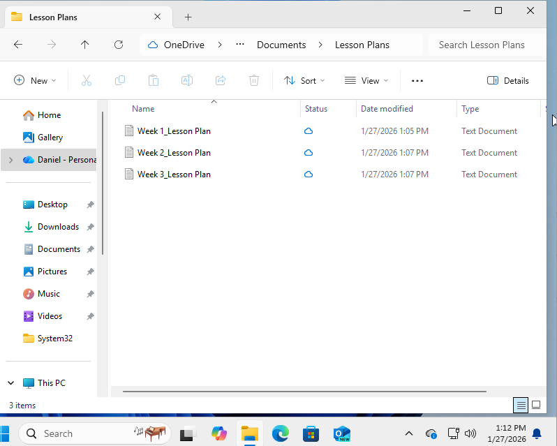
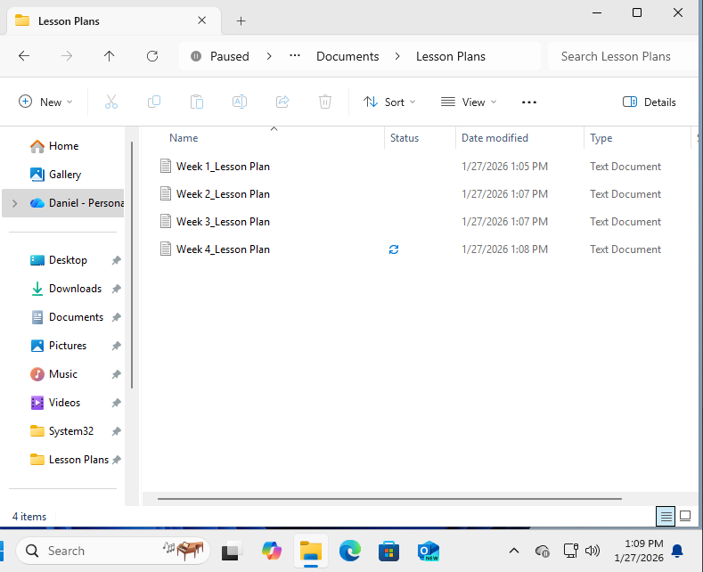
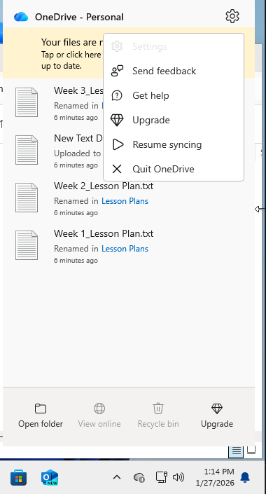
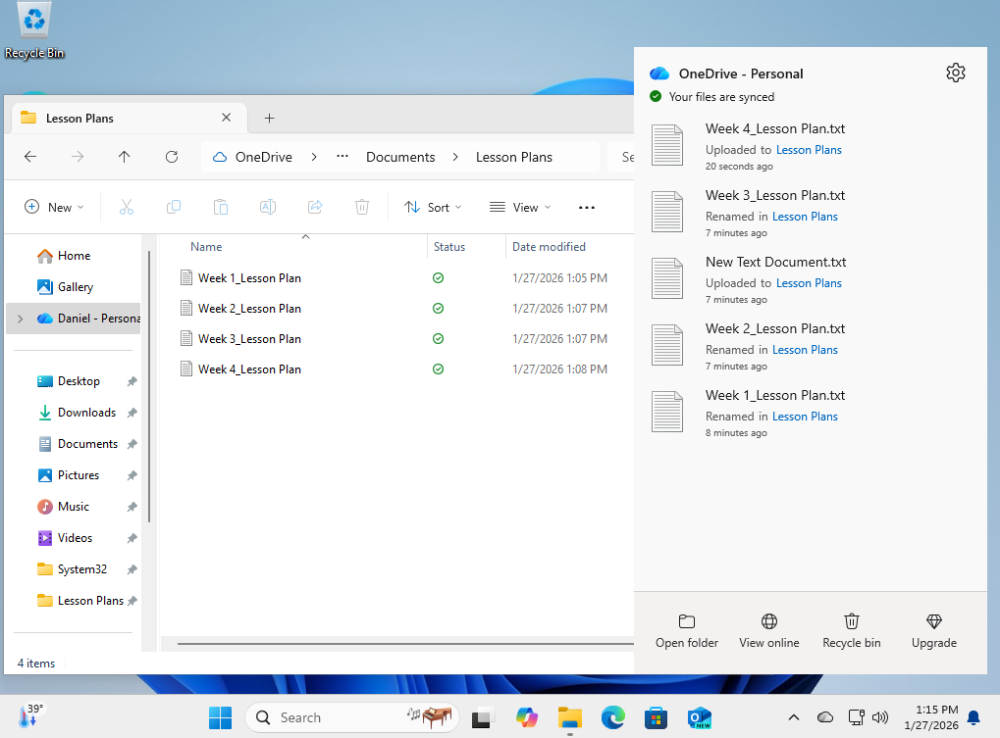
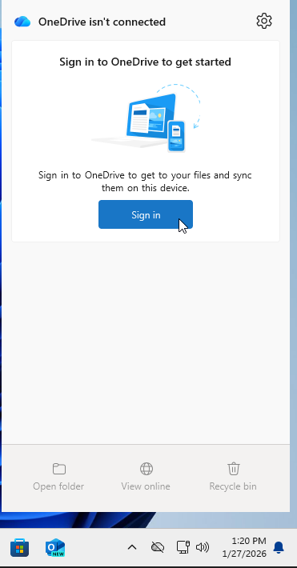
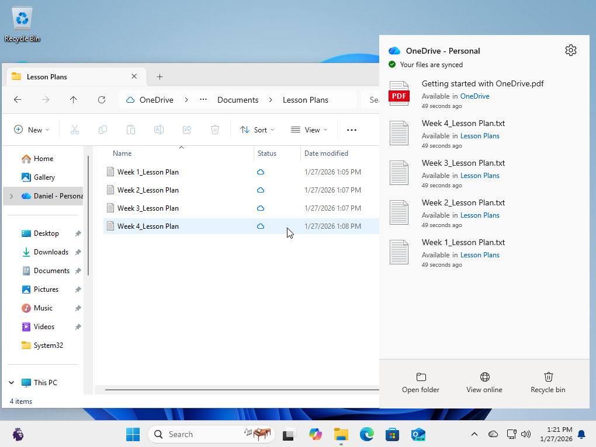

# TKT-002 – OneDrive Not Syncing (Cloud Storage Sync Failure)

## User intake form
- Who: Prof. Daniel Rivera / daniel.rivera@university.edu
- What: Files saved to OneDrive folder are not showing up on other devices.
- When: Issue noticed earlier in the day after updating lecture materials (approx. 2 hours before ticket submission)
- Where: Faculty office workstation
- Why: Unable to access updated documents from classroom and mobile devices
- How: Unknown
- Urgency: Medium

---

## IT input/verification
- Who: Prof. Daniel Rivera / daniel.rivera@university.edu
- What: Files were not appearing in the office computer's local OneDrive folder. 
- When: Verified immediately after ticket intake
- Where: Faculty office device
- Why: OneDrive client not actively syncing with Microsoft cloud services
- How: Sync process paused or not signed in
- Urgency: Medium

---

## Initial Assessment
- Scope: 1 to 2 endpoints affected
- Recent changes: User recently updated files from their laptop and is now trying to access the files from their desktop.
- Hypothesis: OneDrive sync paused or not signed in.

---

## Troubleshooting Timeline

### 1) Replicated user issue on Desktop  
From Desktop: Confirmed the user was signed in and opened the OneDrive folder to verify that files were missing.

---

### 2) Checked OneDrive system tray icon on Laptop 
From Laptop: Observed OneDrive icon showing paused status.

---

## Root Cause
The OneDrive sync was paused on the user's Laptop, preventing files from uploading to the cloud. This stopped new or updated files from being available on other devices.

---

## Resolution Steps

### 1) Resumed OneDrive sync  
Selected "Resume syncing" from the OneDrive system tray menu.

---

### 2) Ensured necessary files were uploaded
Verified OneDrive stated files were synced.

---

### 3) Restarted OneDrive client  
Unlinked OneDrive to ensure refresh of background services resumed correctly.

---

### 4) Signed back into OneDrive
Verified User was signed back into OneDrive

---

### 5) Verified file availability  
Checked the OneDrive folder to confirm files uploaded successfully.

---

## Prevention / Best Practice
- Avoid pausing OneDrive sync
- Educate users on system tray icons and sync indicators
- Periodically verify OneDrive status after major file changes

---

## Escalation Decision
Not escalated. Issue was isolated to local client settings and resolved at the endpoint.

---

## Lessons Learned
This scenario reinforced the importance of:
- Checking application status indicators
- Verifying cloud sync clients are actively running

---

**Status: Resolved**

