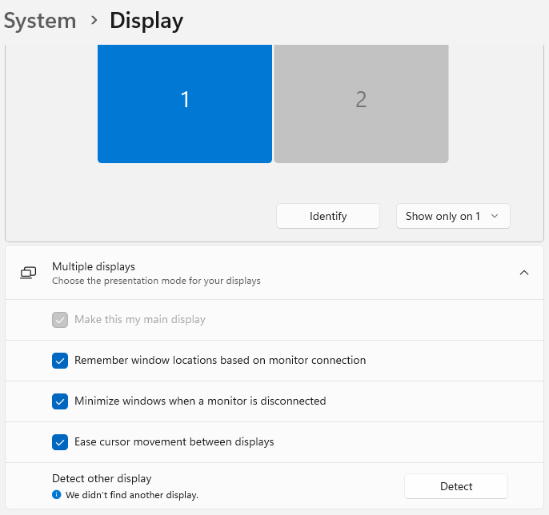
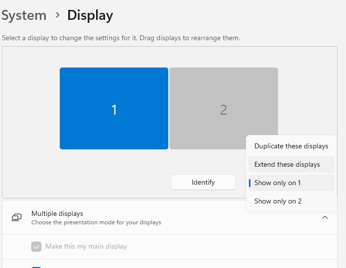

# TKT-003 – Classroom Display Shows "No Signal"

## User intake form
- Who: Dr. Emily Chen / emily.chen@university.edu
- What: Classroom projector displays "No Signal" when laptop is connected. Lecture slides not appearing on screen.
- When: Issue noticed at the start of scheduled class (approx. 10 minutes before class began)
- Where: Health Sciences Campus – Room 2B-114
- Why: Unable to present lecture materials to students
- How: Unknown
- Urgency: High

---

## IT input/verification
- Who: Dr. Emily Chen / emily.chen@university.edu
- What: Instructor laptop connected via HDMI adapter, but classroom display not detecting input.
- When: Verified immediately upon arrival to classroom
- Where: Health Sciences Campus – Room 2B-114
- Why: AV system not receiving video signal from instructor device
- How: Possible incorrect display mode or input source
- Urgency: High

---

## Initial Assessment
- Scope: Single classroom affected
- Recent changes: Instructor connected work laptop using HDMI adapter
- Hypothesis: Incorrect input source, loose/bad cable, or incorrect display mode

---

## Troubleshooting Timeline

### 1) Replicated the issue  
Verified HDMI connections on the instructor's laptop to the projector and confirmed HDMI input source. Still displayed "No Signal".

---

### 2) Checked laptop display settings  
Opened Windows display settings and confirmed system was not duplicating or extending display.

---

## Root Cause
The instructor’s laptop was not set to extend its display to the external screen. As a result, the classroom projector did not receive a video signal, displaying "No Signal."

---

## Resolution Steps

### 1) Changed display mode  
Changed display mode to **extend** display.

---

### 2) Confirmed signal restored  
Classroom display began showing laptop screen successfully.

---

## Prevention / Best Practice
- Provide quick reference guides in classrooms for connecting laptops
- Encourage instructors to test AV setup before class begins
- Label classroom input sources clearly

---

## Escalation Decision
Not escalated. Issue was resolved at the endpoint and classroom AV connection level.

---

## Lessons Learned
This scenario reinforced the importance of:
- Checking both physical and software display settings
- Understanding how operating systems handle multiple displays
- Using quick keyboard shortcuts (`Windows + P`) for rapid AV troubleshooting

---

**Status: Resolved**
