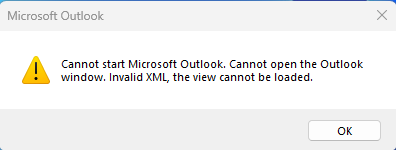
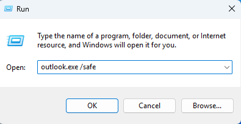
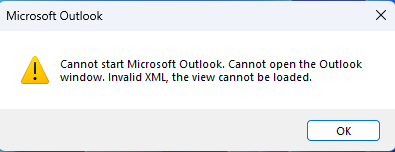
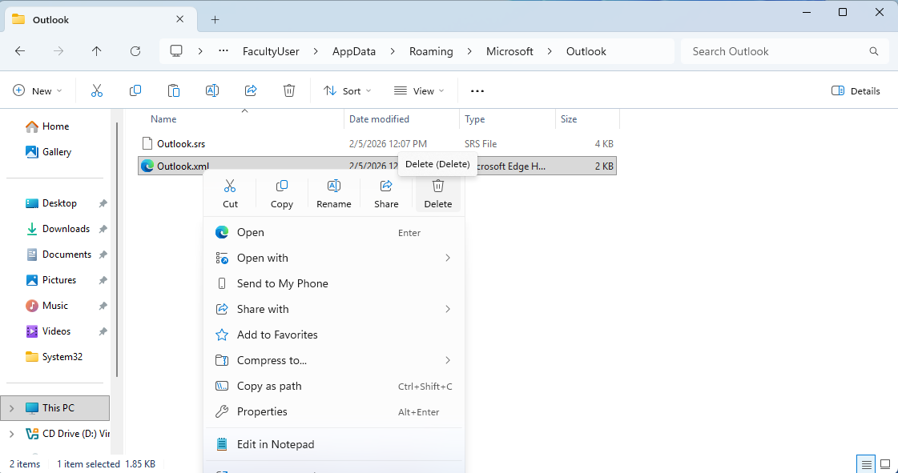
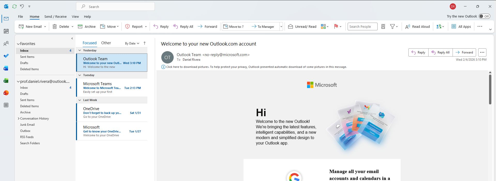

# TKT-005 – Outlook Fails to Load Mail Profile

## User intake form
- Who: Prof. Daniel Rivera / daniel.rivera@university.edu
- What: Outlook displays an error on launch and will not open the mailbox.
- When: Issue began the morning of ticket submission when attempting to check email before class
- Where: Work Laptop
- Why: Unable to access university email and calendar
- How: Unknown
- Urgency: High

---

## IT input/verification
- Who: Prof. Daniel Rivera / daniel.rivera@university.edu
- What: Confirmed Outlook throws an error and cannot open the Outlook window.
- When: Verified immediately after ticket intake
- Where: Professor's work laptop
- Why: Unable to access university email and calendar
- How: Suspected corrupted configuration file
- Urgency: High

---

# Initial Assessment
- Scope: Single endpoint affected
- Recent changes: User reported recent Windows updates
- Hypothesis: Outlook startup configuration file corruption preventing UI from loading

---

## Troubleshooting Timeline

### 1) Replicated the issue
Opened Outlook and confirmed error message.

---

### 2) Attempted safe mode launch
Tried to run Outlook in Safe Mode to rule out add-in conflicts. Safe Mode produced the same error, indicating the issue was not caused by add-ins.

---

## Root Cause
The Outlook Navigation Pane configuration file (`Outlook.xml`) became corrupted, preventing Outlook from loading the user interface. Safe Mode did not resolve the issue because the corruption was within a core configuration file rather than add-ins.

---

## Resolution Steps

### 1) Investigated user configuration files  
Navigated to the Outlook configuration directory: Located `Outlook.xml`, which stores Navigation Pane and layout settings.

---

### 2) Removed corrupted configuration file  
Deleted the `Outlook.xml` file to allow Outlook to rebuild a clean configuration.

---

### 3) Relaunched Outlook  
Opened Outlook normally after deleting the corrupted file. Outlook successfully rebuilt the configuration and loaded the mailbox.

---

## Prevention / Best Practice
- Close Outlook properly before shutting down the computer  
- Avoid forcing shutdowns during updates  
- If Outlook startup errors occur, check for corrupted Navigation Pane files 

---

## Escalation Decision
Not escalated. Issue was resolved at the endpoint by removing the corrupted configuration file.

---

## Lessons Learned
- Using Safe Mode to rule out add-in conflicts  
- Understanding where Outlook stores user configuration files  
- Recognizing when file corruption affects application startup  

---

**Status: Resolved**

